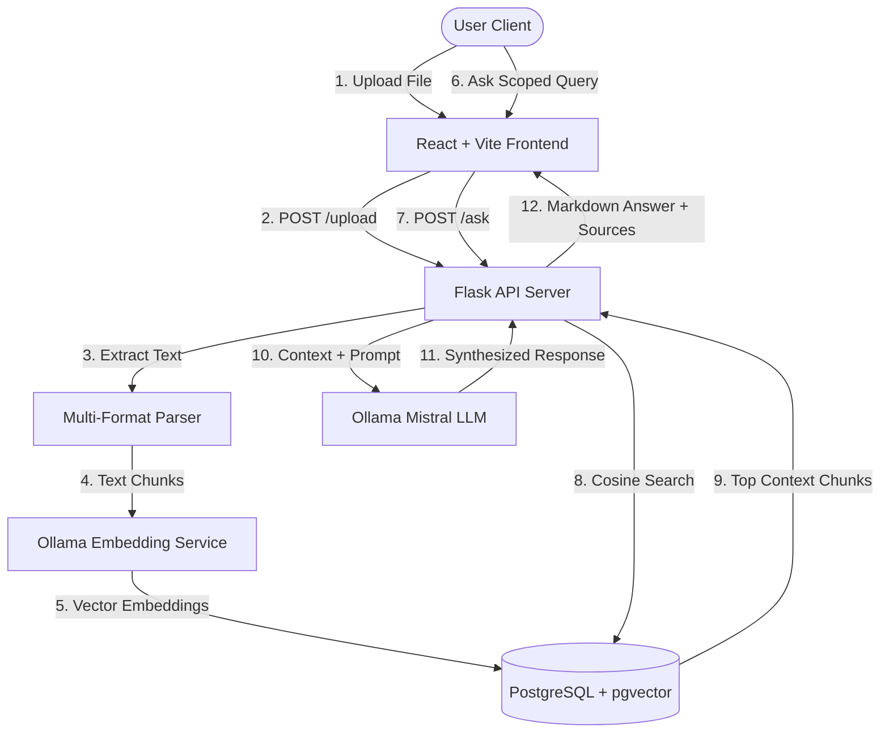

# 📘 Gyaan Kosh — Private AI-Powered RAG Study Assistant

**Gyaan Kosh** (ज्ञान कोष — meaning *Knowledge Repository* in Sanskrit) is an advanced, production-grade, private AI study assistant. It allows users to upload local files (PDFs, DOCX books, TXT logs, and Excel spreadsheets), chunk and index them into a Vector Database, and execute semantic **RAG (Retrieval-Augmented Generation)** searches entirely locally using Ollama and Mistral.

The platform is designed with a premium, Vercel-like **glassmorphic dark AI aesthetic**, micro-animations, active service health pings, context scoping, and full responsive design.

---

## 🚀 Key Features

* **🌌 Cosmic AI SaaS Aesthetics:** Eye-watering landing pages, moving glowing gradient grids, glassmorphism boundaries, and smooth Framer Motion spring transitions.
* **🔒 100% Data Privacy:** Powered by local LLMs via Ollama. None of your academic papers, textbooks, or personal notes ever leave your machine.
* **⚡ Multi-Format Document Sandbox:** Ingests textbooks, manuals, notes, and tables with full support for `.pdf`, `.docx`, `.txt`, and `.xlsx`.
* **📁 Scoped Context Querying:** Check and uncheck specific files in the sidebar to scope vector searches down to selected documents (similar to Google NotebookLM).
* **💡 Semantic Accordions:** Renders exact retrieved text fragments used to answer the question, supporting copy-to-clipboard actions.
* **📈 Bulk Seeding:** Populates vector libraries instantly in one click by loading files placed inside the server's local `knowledge_base` folder.
* **🩺 Infrastructure Health Badges:** Real-time health monitors periodically check Flask API connectivity, local Ollama states, and vector DB volume.

---

## 🏗️ System Architecture



---

## 🛠️ Tech Stack

### Frontend Architecture
* **Core:** React 18 (Hooks) + Vite 5 (SPA Bundler)
* **Styling:** Tailwind CSS 3 + Vanilla PostCSS
* **Animations:** Framer Motion (Accords, spring modals, optimistic bubbles)
* **Icons:** Lucide React + React Icons
* **Rich Content:** React Markdown + Remark GFM (For table/code bubble parsing)
* **Networking:** Axios client (Dynamic URL state managers)

### Backend Architecture
* **Core:** Python Flask Server + Flask-CORS
* **ORM:** SQLAlchemy (Raw cursor binds)
* **Database:** PostgreSQL + `pgvector` extension
* **Embedding Model:** Ollama `nomic-embed-text`
* **Inference Model:** Ollama local `mistral` (7B parameter LLM)

---

## 🔌 API Endpoints Reference

The backend operates on a base URL configuration (default: `http://127.0.0.1:5000`).

### 1. Upload Document
* **Endpoint:** `POST /upload`
* **Payload:** `multipart/form-data` containing `file`
* **Response:**
  ```json
  {
    "message": "File processed successfully",
    "chunks": 12
  }
  ```

### 2. Ask Scoped Query
* **Endpoint:** `POST /ask`
* **Payload:**
  ```json
  {
    "query": "Summarize the core requirements",
    "documents": ["syllabus.pdf", "notes.docx"] // Array of filenames (Optional context scope)
  }
  ```
* **Response:**
  ```json
  {
    "answer": "The core requirements are...",
    "sources": [
      "Page 2: Core requirements include 4 projects and a final exam...",
      "Syllabus doc: Grade weight: Projects (40%), Exam (60%)..."
    ]
  }
  ```

### 3. Seed Knowledge Base
* **Endpoint:** `POST /seed`
* **Response:**
  ```json
  {
    "message": "Knowledge base created",
    "total_chunks": 48
  }
  ```

### 4. Fetch Index List
* **Endpoint:** `GET /documents`
* **Response:**
  ```json
  {
    "documents": ["syllabus.pdf", "notes.docx", "resume.pdf"]
  }
  ```

---

## ⚡ Setup & Launch Instructions

### Prerequisites
1. **NodeJS** (v18 or higher)
2. **Python** (v3.9 or higher)
3. **Ollama** installed locally. Make sure you run:
   ```bash
   ollama pull mistral
   ```
4. **PostgreSQL** with `pgvector` enabled (such as a local database or a cloud database on **Supabase**).

---

### Step 1: Backend Setup
1. Navigate to the backend directory:
   ```bash
   cd backend
   ```
2. Activate your virtual environment:
   * **Windows:**
     ```powershell
     .\venv\Scripts\activate
     ```
   * **macOS/Linux:**
     ```bash
     source venv/bin/activate
     ```
3. Install required Python packages:
   ```bash
   pip install -r requirements.txt
   # Ensure flask-cors is installed
   pip install flask-cors
   ```
4. Verify your environment variables inside [backend/.env](file:///c:/Users/surya/Desktop/gyaan%20kosh/backend/.env):
   ```env
   DATABASE_URL=postgresql://<user>:<password>@<host>:5432/<dbname>
   ```
5. Launch the Flask API server:
   ```bash
   python app.py
   ```
   *Server starts running on `http://127.0.0.1:5000`*

---

### Step 2: Frontend Setup
1. Open a new terminal tab and navigate to the frontend directory:
   ```bash
   cd frontend
   ```
2. Install NodeJS packages:
   ```bash
   npm install
   ```
3. Boot the Vite development server:
   ```bash
   npm run dev
   ```
4. Click the link in the terminal (usually `http://localhost:5173`) to launch Gyaan Kosh in your browser!
